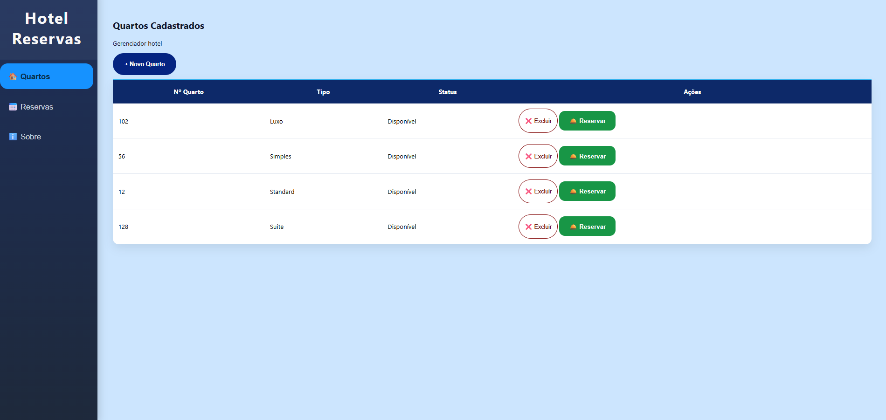
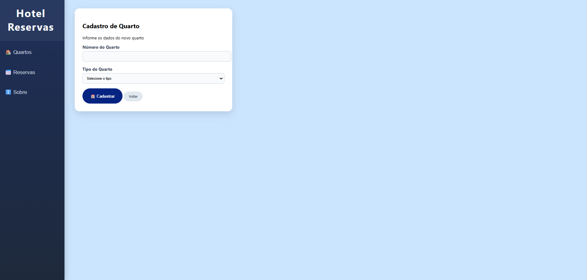
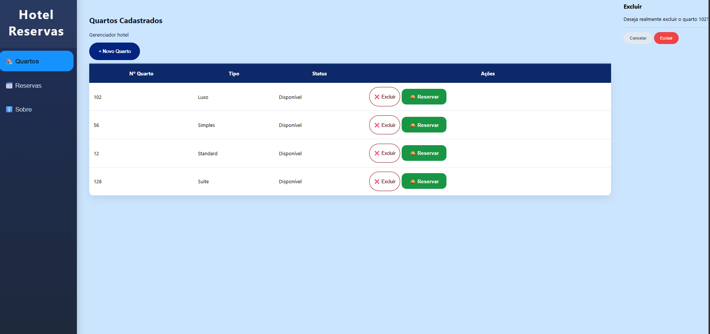
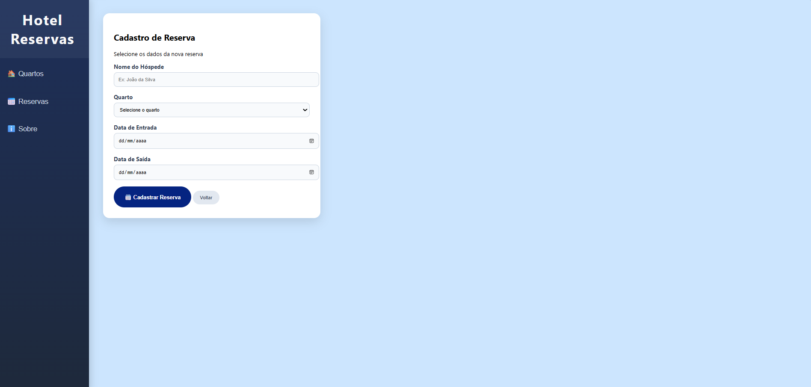
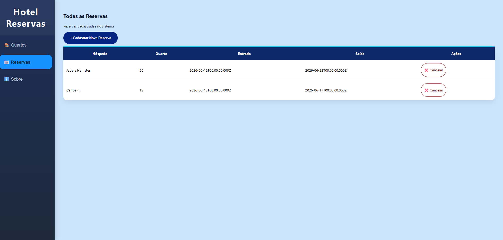
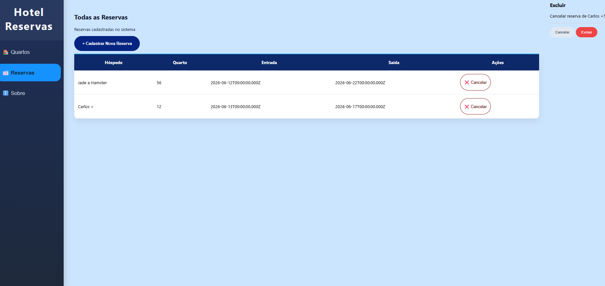
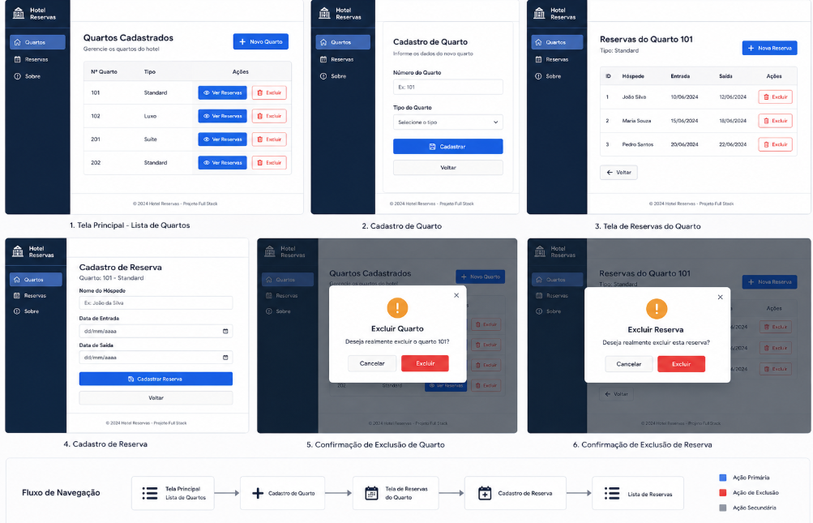

# HOTEL RESERVAS
Situação de Aprendizagem - Full-stack (Node.JS, JavaSript, VsCode, ORM Prisma, Insomnia)

# Visual do site







# Referência


# Passo a passo
- Clone e instale este repositório
```bash
git clone https://github.com/MoniqueBabler/hotelreservas.git
```


- Crie um arquivo `.env` na raiz do projeto:

```env
PORT=3000
DATABASE_URL="mysql://root@localhost:3306/mydb"
```

- Executar as migrations do banco de dados

```bash
npx prisma migrate dev
```

- Iniciar o servidor

```bash
npm run dev
```

O servidor estará disponível em `http://localhost:3000`.

## Abrir o frontend

Abra o arquivo `index.html` diretamente no navegador,  
ou utilize uma extensão como o **Live Server** no VS Code.

#

# 🏨 Sistema de Gerenciamento de Hotel

### ⚙️ Funcionalidades do sistema

###  Quartos
- Cadastrar quartos
- Visualizar quartos cadastrados
- Excluir quartos
- Visualizar reservas associadas a cada quarto

### Reservas
- Cadastrar reservas vinculadas a um quarto
- Visualizar reservas de um quarto
- Excluir reservas


## Requisitos de infraestrutura

- **IDE utilizada:** Visual Studio Code
- **SGBD:** MySQL (ou MariaDB)
- **Servidor de aplicação:** Node.js
- **Back-end:** Express.js (ou similar)
- **Front-end:** HTML, CSS e JavaScript
